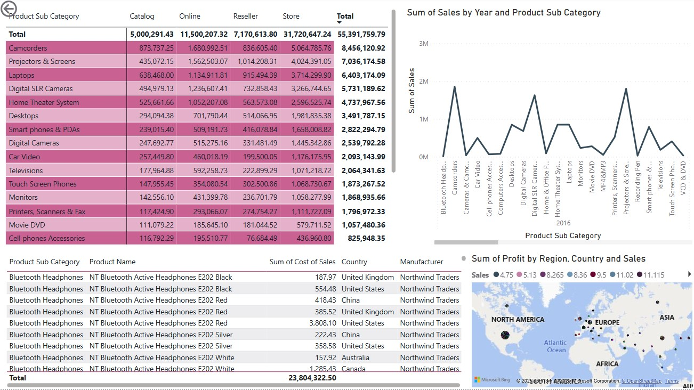
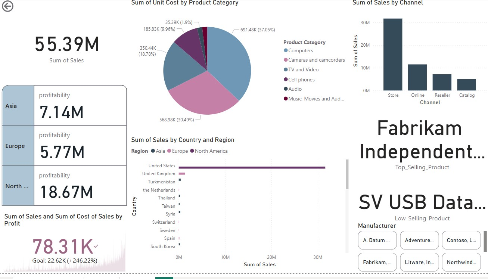

# 📊 Sales Report Power BI Dashboard

This project contains an interactive **Power BI Dashboard** analyzing sales, profit, and product performance.

## 📸 Dashboard Screenshots

### 📊 Vedio

### 📈 Sales & Profit Trends

### 📊 Best & Worst Products

### 🌍 Market Analysis

## 📂 Project Files
- **Dashboard.pbix** → Power BI file 📊
- **Final_Sales_Report.docx** → Sales analysis report 📄
- **images/** → Screenshots 📸

## 🚀 How to Use
1. Download **Dashboard.pbix** and open in Power BI.
2. Review insights from the sales report.
3. Explore the README for project details.

📌 **Author:** [Rana]  
📌 **GitHub Repository:** [Your Repo Link](https://github.com/ran-ibra/Sales-Report-Project)
